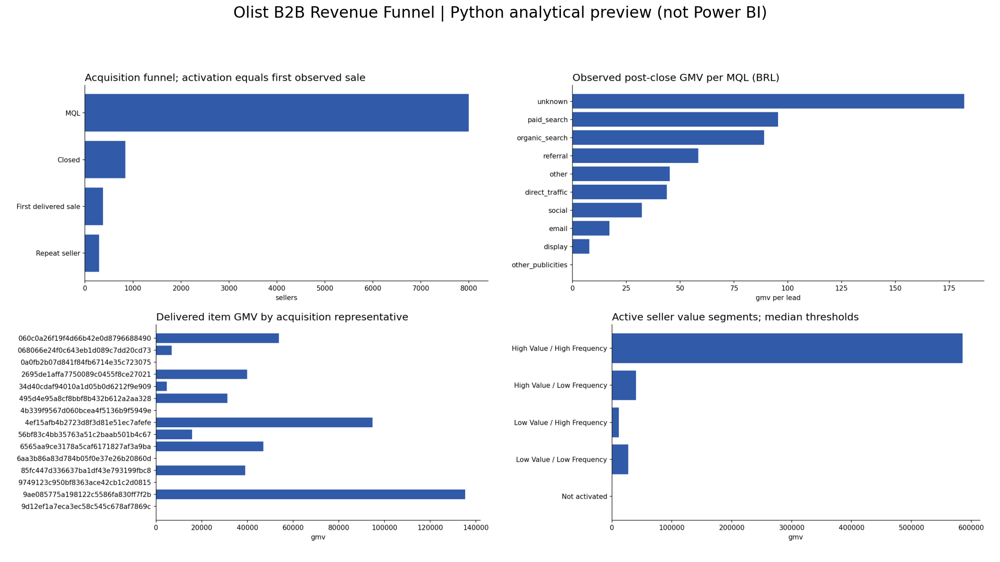

# Olist B2B Revenue Funnel

**Owner:** Satya Ranjan Nayak

**Status:** Source analysis completed; Power BI Desktop build remains manual.

## Business Problem

Which acquisition channels and sales activities bring sellers who generate downstream marketplace merchandise value?



## Dataset

https://www.kaggle.com/datasets/olistbr/marketing-funnel-olist
https://www.kaggle.com/datasets/olistbr/brazilian-ecommerce

Source snapshot (download raw CSVs into `01_Raw_Data/` before rerunning): https://github.com/dujiaying/olist/tree/96d0db2e45e684d5a7069911368d823a19e82d38/data . Git blob hashes verified byte-for-byte. Preserve these files unchanged; the pipeline writes derived CSVs elsewhere. See source_manifest.json for local SHA256 hashes. Review original dataset license before redistribution.

## Tools Used

Python (pandas, NumPy, SciPy, Matplotlib), SQLite SQL, Excel, and a Power BI reproduction package. No ML model. No .pbix is claimed.

## Dataset Architecture

See [relationship map](08_Documentation/data_model.md), [data dictionary](08_Documentation/data_dictionary.csv) and [metric definitions](08_Documentation/metric_definitions.md).

## Data Cleaning

Exact duplicate records removed in derived data; conflicting entity keys fail validation. String values trimmed; dates parsed explicitly; invalid elapsed durations excluded from relevant KPI averages. Unknown values stay NULL. Raw files stay unchanged. See data_quality_summary.csv and source_manifest.json after a successful run.

## Business Questions

The four dashboard pages map each visual to a business question in dashboard_documentation.md. SQL answers channel/segment or operational performance questions with explicit denominator choices.

## SQL Analysis

Four scripts cover quality controls, date coverage, grouped business outcomes, and advanced CTE/window analyses. Query results are saved separately in 03_SQL/results. SQLite is the supported dialect; no server setup required. Schema is generated from observed data types, with logical keys validated by Python and SQL controls.

## Python Analysis

Executed cleaning and analysis notebooks accompany this Olist B2B project. Descriptive statistics, segmentation, correlation or exploratory group tests are used where meaningful.

## Excel Analysis

The workbook imports manageable complete SQL result tables and adds formula-based comparison metrics. Detailed row-level records remain in cleaned CSVs. Native slicers and PivotTables are not claimed. See 05_Excel/README.md for workbook scope and refresh procedure.

## Dashboard

Four-page Power BI specification, DAX library, typed CSV model, relationship map, theme and Power Query loader are supplied. Python preview images and an offline HTML report visualize calculated outputs but are not Power BI screenshots.

## Key Insights

- 8,000 MQLs produced 842 closed deals (10.53% conversion).
- 376 converted sellers had delivered orders purchased after closing (44.66% activation).
- Attributed item GMV was BRL 664,858.00; this is marketplace merchandise value, not Olist net revenue.
- Top 38 active sellers (ceiling of 10%) contributed 64.82% of attributed GMV.
- 295 sellers generated at least two post-close delivered orders.
- unknown had the highest observed GMV per lead among channels with at least 50 MQLs: BRL 181.96.

## Recommendations

- Use observed GMV per lead together with activation to shortlist channel experiments; acquire spend data before claiming ROI.
- Prioritize onboarding for converted sellers without post-close delivered orders. Separate recent wins from fully observed cohorts.
- Inspect the largest seller accounts individually because concentration makes channel results sensitive to a few merchants.
- Obtain assignment histories for lost leads before measuring SDR or sales-representative conversion rates.

## Limitations

- Marketplace GMV is item price, not Olist commission revenue. Freight and platform take rate are excluded.
- SDR, sales representative, business segment and lead type exist only on won deals. Their conversion rates cannot be computed without assignments for lost leads.
- Activation is the first observed post-close delivered order; active seller and first-order stages cannot be separately identified.
- Recent acquisitions have shorter observation windows. No causal channel comparison, channel ROI, CAC or long-term LTV is claimed.
- Only converted sellers linking to marketplace orders can be monetized. Sellers without matches remain in the activation denominator.
- Negative lead-to-close durations are excluded from closing-speed averages, but those deal records remain in conversion and attribution counts.

## Repository Structure

```
01_Raw_Data/  source acquisition instructions (raw CSVs excluded from Git)
02_Cleaned_Data/  dimensional and fact CSVs
03_SQL/  schema, analysis scripts and query outputs (database regenerated locally)
04_Python/  standalone pipeline and two notebooks
05_Excel/  workbook and its data export
06_PowerBI/  DAX, M, theme, relationships and visual specifications
07_Images/  real Python chart previews
08_Documentation/  definitions, quality report, validations and recommendations
```

## How to Reproduce the Analysis

```bash
python -m pip install -r requirements.txt
python 04_Python/pipeline.py
```

Run notebooks from 04_Python or project root after source acquisition. All raw source files must be present. Pipeline exports cleaned data, runs every named SQL query and validates control totals. Regenerate the Excel workbook using the included artifact-tool builder in the ChatGPT runtime, or import the exported result CSVs into Excel using Data > From Text/CSV. Power BI Desktop instructions are in 06_PowerBI/dashboard_documentation.md.
